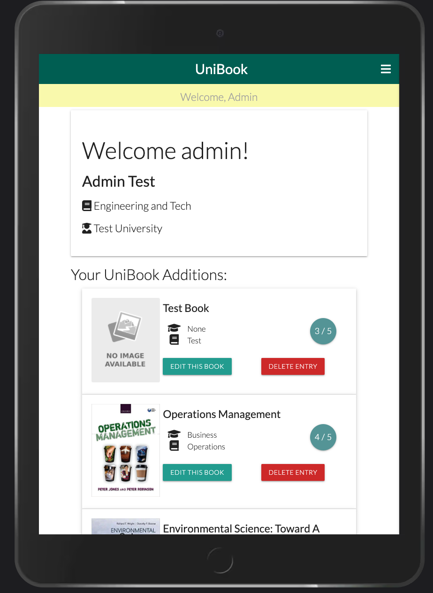

# **UniBook**

## **[View the Live Website Here!](https://uni-book-ms3-project.herokuapp.com/)** ##

## **Code Institute Milestone 3 Project - Backend Development**
The project has been undertaken to build an efficient, simple and accessible book collection website. The site will enable University students, graduates and staff to search through different topics, add books to the sites collection, own a profile and have access links to purchase books. 

The site will feature a log in and register function where the user will gain the ability to add books to their collection and leave a review and score rating. The site willbe in the most simple format possible has been designed to not overwhelm the user with information.

# Table of Contents:
- [**UX**](#--ux--)
  * [User Stories](#user-stories)
  * [Strategy](#strategy)
  * [Scope](#scope)
  * [Structure](#structure)
  * [Skeleton](#skeleton)
    + [**Wireframes**](#--wireframes--)
    + [**Changes to initial wireframes**](#--changes-to-initial-wireframes--)
  * [Surface](#surface)
- [**Features**](#--features--)
  * [1. Landing Page](#1-landing-page)
  * [2. Profile Page](#2-profile-page)
  * [3. Logi and Book Features](#3-login-and-book-features)
- [**Technologies**](#--technologies--)
  * [Languages](#languages)
  * [Libraries, Frameworks and Technologies](#libraries--frameworks-and-technologies)
  * [Workspace and Version Control](#workspace-and-version-control)
- [**Testing**](#--testing--)
  * [Code Validators](#code-validators)
  * [Javascript](#javascript)
  * [Python](#python)
  * [Responsive Elements](#responsive-elements)
  * [Search Accuracy and Functionality](#search-accuracy-and-functionality)
  * [UX User Story Test](#ux-user-story-test)
- [Deployment](#deployment)
  * [Github Pages Deployment:](#github-pages-deployment-)
  * [Forking The Repository:](#forking-the-repository-)
  * [Creating a local clone:](#creating-a-local-clone-)
  * [Heroku Deployment](#heroku-deployment)
- [**Credits**](#--credits--)
  * [Content](#content)
  * [Media](#media)
  * [Acknowledgements](#acknowledgements)

# **UX**
## User Stories
----------------
In this project there are three groups of target users. They include university students, the admin and site owner and general users. The user stories for eac group are defined below.

__Applicable to all users__
- As a user, I would like to easily navigate and understand the site on landing.
- As a user, I require a link to purchase the books.
- As a user, the ability to log in and register is important.
- As a user, I would like to be able to rate and review books, and add them to the site collection.
- As a user, I need to be able to search the collection for different topics.

__General user__
- As a general user, I require to be able to view and use elements of the site without logging in.
- As a general user, I would like to still have the option to follow the link to buy without registering an account.

__Admin Users__
- As an admin, I require the ability to edit and delete topics and books. 
- As an admin, I need to access the books quickly with direct links to edit and delete functions. 

## Strategy
----------------
__Project goals__

The aim of this project is present  in a simple and clear but professional way. It was important to create a user-friendly and approachable site with a modern design and feel. The book collection had to be presented to the user in a way that they can quickly decipher the main topic area and then the more focused sub topic. This makes the site more accessible to users who are studying and need to find information quickly.

The features and content of the site therefore had to include;
- Book titles, authors and descriptions.
- Common topics of University study along with sub-topics of interest. For example, Science and Physics.

__User goals__ 

The user goals will be met by enabling the user get access to the collection in a clear and concise format. The users require the ability to quickly search for their topic and filter out the irrelevant information. The users goals will be achieved through a landing page featuring a basic structure of cards with book information and a linked image. There will also be links to log in and register. 

## Scope 
----------------

The site will be built for purpose and the content should be accesible and user friendly. The scope therefore includes:
- A landing page featuring books with title images and relevant topics clearly displayed.
- An ability to search from the landing page.
- A log in function where the user inputs username and password.
- A register function, the user will input relevant details and create a profile.
- A profile page, displaying the books the user had added to the collection.
- An ability to follow a link to purchase any book on the site through amazon.

## Structure
----------------

The structure of the site is built around the main landing page where the user can see all the books in the collection and search through them.

1. **Landing Page**
- Simple landing page, with a search bar and simple cards showing the book title, and topics with a cover image. 
- The cards will also feature the user rating out of 5.
- The cards are interactive and when clicked will reveal author and a brief description of the book. 
2. **Log In/Register Page**
- This page enables the user to input a username and password.
- The page will link to a register page where the user can input name and study topic.
3. **Profile Page**
- This page displays the user profile with their username and their study topics.
- The books the user has added will be displayed along with an option to edit or delete the entries.
4. **Add Book Page**
- This page is directly linked in the nav bar and enables the user to add a book to the collection.
- Consists of a simple form to fill out along with descriptions and the ability to add a purchase link.

## Skeleton 
----------------
### **Wireframes** ###

The Skeleton of the project design was built utilising [Balsamiq](https://balsamiq.com/). 

The overall basic design breakpoints can be seen below:

### **Changes to initial wireframes** ###
A number of design edits were made throughout the project with the purpose of increased userability and clarity. These include:
- The navbar will be consistent throughout the pages.
- The form field will feature a clearer more concise design with prompts.
- The elements will be softer on the background and will not be large block features as seen above. 
- The elements will have clear icons for user experience.
 

## Surface 
----------------
The site aimed to be bright, clear and simple. The colour choice was to be light so that nothing distracts from the key data and information. The light will be contrasted with dark green nav and footer elements.

**Colour Theme**

**Typography**

- The font used for both body and headings is [Lato
Designed by Łukasz Dziedzic](https://fonts.google.com/specimen/Lato). This font was chosen for its professionalism and clarity.
I wanted to bring a modern design feel to the site and utilising a font that is widely used was effective.
The site also has 'Sans Serif' as an alternative font.

# **Features**
----------------
## 1. Landing Page
-----------------
The landing page features a responsive card list of all books on the site. The page features a search bar to enable users to search through the collection. The feel of the site is light. The site navigation is clear and consistent with standard practice. Links to purchase the books are clearly visible with the user rating featured too.

----------------------
## 2. Profile Page
----------------------
The profile page features a welcome element and displays the users fields of study along with the University they study in. The book additions that the user has made to the site are clearly diplayed on the profile. There are options fir the user to edit their collection and delete an entry they have made if required.

---------------------
## 3. Login and Book Features
---------------------
The login page is simple and displays prompts for the user to input their username and password. The site also features a link to register if the user has not yet done so.

The add book page is a simple form with user prompts to input the required format. There is defensive programming employed to ensure the user does not input information in the wrong format. The user can add the purchase link and also can replace the image link if they can find an image url for their chosen book.

# **Technologies**
## Database
---------------
The database used was mongoDB. The data structure can be seen below:

The content is broken down in clear descriptions with text inputs from the forms. The image and we links are stored as plain text. The naming convention was kept concise and relevant to the site.

## Languages
---------------
For this project two languages were used:
- [HTML](https://www.w3schools.com/html/#:~:text=HTML%20is%20the%20standard%20markup,learn%20%2D%20You%20will%20enjoy%20it!)
- [CSS](https://www.w3schools.com/css/)
- [Javascript](https://www.javascript.com/)
- [Python](https://www.python.org/)

## Libraries, Frameworks and Technologies
---------------

- [Materialize](https://materializecss.com/) - Materialize was used to for its wasy to use grid and repsonsive layout. Elelments of the navbar, cards and forms were taken from the site.

- [Coolors](https://coolors.co) - Used to create colour palette and test colour themes.

- [Google Fonts](https://fonts.google.com/) - Google font 'Lato' was included in the project.

- [Font Awesome](https://fontawesome.com/) - All icons used throughout the project come from fontawesome.

- [JQuery](https://jquery.com/) - Used for aspects of userability.

- [MongoDB](https://www.mongodb.com/) - Used for the database.

- [Mock-Up Generator](https://techsini.com/multi-mockup/index.php) - Used for title photo.

- [Heroku](https://id.heroku.com/login) - Used for site deployment.

- Werkzeug, PyMongo, Jinja and Flask - Frameworks used for templates, web application libraries and tooling for database link up.

## Workspace and Version Control
--------------------
- [Github](https://github.com/) - The project is hosted on Github and the live website is worked through Github pages.

- [Gitpod](https://www.gitpod.io/) - The project used Gitpod IDE for build and development. 

# **Testing**
## Code Validators 
---------------
A number of code validation techniques were utilised to ensure proper testing of site. 
For HTML and CSS, I used the [W3C Markup Validator](https://validator.w3.org) and [W3C CSS Validation Services](https://jigsaw.w3.org/css-validator/). 
See below for results.

- HTML: A warning for Jinja template language. No other errors.
- CSS: A warning for auto setting on height. No fix required. 

## Javascript
--------------
A combination of [JSHint](https://jshint.com/) and manual testing was completed on the javascript to ensure adequate quality. 
- Firefox warning from JSHint. No fix required
- No errors found in manual test. JQuery from materialize used and functioned well.

## Python
--------------
[PEP8 Online]() used to test Python. 

- Over indentation found but was unable to fix.

## Responsive Elements 
--------------

The responsivity of the page was tested primarily using [Google Chrome Dev Tools]() and manual resizing of windows. The test provided positive results for each 
device option. The responsive breakpoints and resizing worked throughout the site. The site was shared with colleagues and friends and tested 
on their devices. The site worked well on all devices tested and there was no problem with browser compatibility found during these tests.

  
## Search Accuracy and Functionality
--------------
Manual testing was completed and the following results were found:

- The search function worked well.
- The add, edit and delete functions completed their required tasks and were easy to use.
- The login and register functions were tested and performed well.

## UX User Story Test
--------------
The user stories previously laid out in the UX Design section are tested, to ensure that project achieves the user goals.

__Applicable to all users__
- *As a user, I would like to easily navigate and understand the site on landing.*
  - The landing page is clear and nav bar displays all relevant links.
- *As a user, I require a link to purchase the books.*
  - A link to purchase books is available for each book card.
- *As a user, the ability to log in and register is important.*
  - The user has the ability to log in and register.
- *As a user, I would like to be able to rate and review books, and add them to the site collection.*
  - The user can add a number rating out of 5 and a detailed decription of the book for other users.
- *As a user, I need to be able to search the collection for different topics.*
  - The user has a search functionality available.

__General user__
- *As a general user, I require to be able to view and use elements of the site without logging in.*
  - The user does not need to be logged in to use the main element of the site. The user can search and follow links to purchase without registering.
- *As a general user, I would like to still have the option to follow the link to buy without registering an account.*
  - The user can follow the purchase link from the landing page.

__Admin Users__
- *As an admin, I require the ability to edit and delete topics and books.*
  - The admin has the key functions required to edit, delete or add any book on the database.
- *As an admin, I need to access the books quickly with direct links to edit and delete functions.*
 - The admin can easily access any book from the landing page or the admin profile page for uploads the admin has made. 

# Deployment 

## Github Pages Deployment:
The project is deployed to GitHub Pages. To deploy the site follow the instruction below.
1. In GitHub navigate to the .
2. Locate '_Settings_', navigate to '_Source_' and select _Master Branch_ from the dropdown and click _Save_.
3. The site will be published and confirmation shown on the page.

## Forking The Repository:
To create a fork of the Repository simply:
1. Navigate to the .
2. Select '_Fork_' on the right hand corner of the page.

## Creating a local clone:
1. In GitHub navigate to the .
2. Above the file list select '_Code_' with the download icon. 
3. To clone select the copy icon at the far right side of URL.
4. Open your terminal in respective IDE, and edit working directory to the desired location.
5. Type `git clone` and paste copied URL.
6. Select Enter and local clone will be created. 

For more specific information relating to the clone follow this [link](https://docs.github.com/en/github/creating-cloning-and-archiving-repositories/cloning-a-repository)

## Heroku Deployment:
This project is deployed using Heroku.

- Log in or create a profile on Heroku. Select and create a new app, select the correct region and click “Create App”.
- Select “Deploy” tab and “Deployment method” section. Click on GitHub.
- Search for the repository, and click “Connect” next to the project repository.
- Next, select the “Settings” tab, and scroll down to “Config Vars”.
- Enter the Key and Value pairs as per your env file;
- Go back to the “Deploy” tab, and scroll down to “Automatic deploys”. Select “Enable Automatic Deploys” then “Deploy Branch”.
- The app will be built over a few minutes.
- You can now click on “Open App” which will launch the deployed app.

# **Credits**
## Content
--------------
 - The Code Institute walkthrough project for backend development.
 - The structure of the site from materialize CSS.

## Media 
--------------
- All icons were sourced from [font awesome](https://fontawesome.com/)

## Acknowledgements
-------------- 
Thanks to the [Code Institute](https://codeinstitute.net) for the tutorials and resources. 
